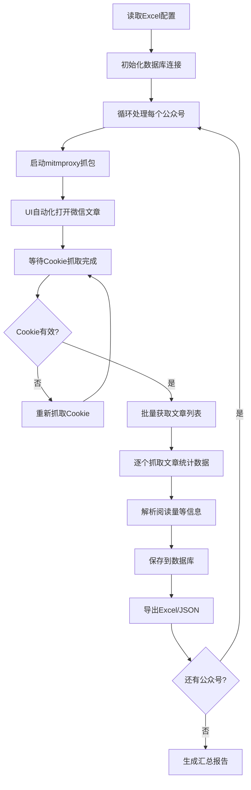

# 微信公众号爬虫系统技术方案

## 1. 系统概述

本系统是一个基于Python开发的微信公众号自动化爬虫工具，专门用于获取公众号文章的阅读量、点赞数、分享数等统计信息。系统采用mitmproxy网络抓包技术和UI自动化技术，实现对微信客户端的自动化操作和数据抓取。

## 2. 系统架构

### 2.1 整体架构图

```
┌─────────────────┐    ┌─────────────────┐    ┌─────────────────┐
│   Excel配置管理   │    │   UI自动化控制   │    │   数据存储层     │
│                 │    │                 │    │                 │
│ • 公众号链接配置 │────│ • 微信客户端操作 │────│ • MySQL数据库   │
│ • 参数配置       │    │ • 文章页面触发   │    │ • Excel导出     │
└─────────────────┘    └─────────────────┘    └─────────────────┘
         │                        │                        │
         └────────────────────────┼────────────────────────┘
                                  │
                    ┌─────────────────┐
                    │   核心爬虫引擎   │
                    │                 │
                    │ • Cookie管理    │
                    │ • 批量数据抓取  │
                    │ • 内容解析      │
                    └─────────────────┘
                            │
                    ┌─────────────────┐
                    │   网络代理层     │
                    │                 │
                    │ • mitmproxy     │
                    │ • 流量拦截      │
                    │ • Cookie提取    │
                    └─────────────────┘
```

### 2.2 模块架构

```
wechat_spider/
├── config/              # 配置管理模块
│   ├── config_manager.py    # 爬虫配置管理
│   └── config.yaml          # 配置文件
├── src/
│   ├── core/                # 核心业务逻辑
│   │   ├── main_enhanced.py     # 主程序入口
│   │   └── automated_crawler.py # 自动化爬虫控制器
│   ├── crawler/             # 爬虫模块
│   │   └── batch_readnum_spider.py # 批量阅读量爬虫
│   ├── proxy/               # 代理管理模块
│   │   ├── read_cookie.py       # Cookie抓取管理
│   │   ├── proxy_manager.py     # 代理管理器
│   │   └── unified_proxy_manager.py # 统一代理管理
│   ├── database/            # 数据库模块
│   │   └── database_manager.py  # 数据库操作管理
│   ├── ui/                  # 用户界面模块
│   │   ├── wechat_browser_automation.py # 微信自动化
│   │   └── excel_auto_crawler.py        # Excel自动化
│   └── utils/               # 工具模块
│       └── utils.py         # 通用工具函数
├── data/                   # 数据存储目录
└── requirements.txt        # 依赖包配置
```

## 3. 核心流程

### 3.1 主流程图



### 3.2 详细流程说明

1. **配置读取阶段**
   - 从Excel文件读取公众号链接列表
   - 加载系统配置参数（超时时间、延迟设置等）
   - 初始化数据库连接

2. **Cookie获取阶段**
   - 启动mitmproxy代理服务器
   - 设置系统代理指向本地mitmproxy端口
   - UI自动化打开微信客户端并访问文章页面
   - 拦截微信网络请求，提取认证Cookie和headers

3. **数据抓取阶段**
   - 使用获取的Cookie调用微信API获取文章列表
   - 逐个访问文章页面，解析HTML内容
   - 提取阅读量、点赞数、分享数等统计信息
   - 解析文章标题、内容、发布时间等元数据

4. **数据存储阶段**
   - 将抓取结果保存到MySQL数据库
   - 同时导出为Excel和JSON格式文件
   - 生成统计汇总报告

## 4. 关键技术组件

### 4.1 网络抓包技术 (mitmproxy)

**技术实现：**
- 使用mitmproxy作为中间人代理服务器
- 拦截微信客户端与服务器之间的HTTPS通信
- 自动安装和信任mitmproxy证书
- 实时解析和保存Cookie信息

**核心代码：**
```python
# 启动mitmproxy进程
command = ["mitmdump", "-s", extractor_path, "--listen-port", str(port), "--ssl-insecure"]
self.mitm_process = subprocess.Popen(command, env=child_env)
```

### 4.2 UI自动化技术 (uiautomation)

**技术实现：**
- 使用Python uiautomation库控制微信客户端
- 自动搜索和点击微信窗口元素
- 模拟用户操作打开文章链接
- 处理窗口状态管理和异常情况

**核心功能：**
- 微信窗口定位和激活
- 文章链接粘贴和打开
- 浏览器窗口管理
- 异常情况处理

### 4.3 数据解析技术

**HTML解析：**
- 使用BeautifulSoup解析文章页面HTML
- 正则表达式提取统计数据
- 多重fallback策略确保数据完整性

**统计数据提取：**
```python
# 阅读量提取
read_num_match = re.search(r"var cgiData = {[^}]*?read_num: '(\d+)'", html_content)
read_count = int(read_num_match.group(1)) if read_num_match else 0

# 点赞数提取
like_num_match = re.search(r"window\.appmsg_bar_data = {[^}]*?like_count: '(\d+)'", html_content)
like_count = int(like_num_match.group(1)) if like_num_match else 0
```

### 4.4 数据库技术 (MySQL)

**数据模型：**
- 文章主表：存储文章基本信息和统计数据
- 公众号对照表：维护公众号名称与单位名称映射
- 异常记录表：记录爬取过程中的异常情况

**核心操作：**
- Upsert操作：插入新数据或更新现有数据
- 事务管理：确保数据一致性
- 连接池管理：提高数据库访问效率

## 5. 数据流向

### 5.1 数据输入流

```
Excel配置 → 公众号列表 → 文章URL列表 → 微信API → HTML页面 → 统计数据
```

### 5.2 数据处理流

```
原始HTML → BeautifulSoup解析 → 正则表达式提取 → 数据清洗 → 结构化数据 → 数据库存储
```

### 5.3 数据输出流

```
数据库 → Excel导出 → JSON导出 → 统计报告 → 用户界面显示
```

## 6. 错误处理机制

### 6.1 Cookie获取失败处理

**检测机制：**
- Cookie验证接口调用
- 返回状态码检查
- 关键字段完整性验证

**恢复策略：**
- 自动重新抓取Cookie
- 刷新文章页面重新触发请求
- 多重尝试机制（最多2次重试）

### 6.2 网络异常处理

**超时处理：**
- 请求超时设置（默认30秒）
- 重试机制（最多3次重试）
- 指数退避算法

**代理异常：**
- 代理服务状态监控
- 自动重启代理服务
- 系统代理设置恢复

### 6.3 数据解析异常

**HTML解析异常：**
- 多重解析策略（BeautifulSoup + 正则表达式）
- 降级处理机制
- 异常数据标记

**数据库异常：**
- 连接重试机制
- 事务回滚处理
- 数据完整性检查

### 6.4 UI自动化异常

**窗口操作异常：**
- 窗口状态检查
- 元素定位重试
- 超时处理机制

**微信客户端异常：**
- 进程状态监控
- 自动重启机制
- 异常情况记录

## 7. 优化建议

### 7.1 性能优化

**并发处理：**
- 实现多线程/异步处理
- 公众号间并行处理
- 数据库连接池优化

**频率控制：**
- 智能请求频率控制
- 随机延迟机制
- 服务器压力监控

**内存管理：**
- 大文件处理优化
- 内存使用监控
- 垃圾回收优化

### 7.2 稳定性优化

**异常恢复：**
- 断点续传机制
- 状态持久化
- 自动重试策略

**监控告警：**
- 系统状态监控
- 异常告警机制
- 日志分析系统

### 7.3 可扩展性优化

**模块化设计：**
- 插件化架构
- 配置驱动设计
- 接口抽象化

**数据处理：**
- 分布式数据处理
- 缓存机制引入
- 数据压缩存储

### 7.4 安全性优化

**反检测机制：**
- 请求头随机化
- 行为模式模拟
- IP轮换策略

**数据保护：**
- 敏感信息加密
- 访问权限控制
- 数据脱敏处理

## 8. 部署和运维

### 8.1 环境要求

- **操作系统：** Windows 10/11
- **Python版本：** 3.8+
- **数据库：** MySQL 5.7+
- **内存：** 8GB+
- **磁盘空间：** 10GB+

### 8.2 依赖包

```
mitmproxy==10.1.1
uiautomation==2.0.18
requests==2.31.0
beautifulsoup4==4.12.2
pymysql==1.1.0
pandas==2.0.3
```

### 8.3 配置管理

**核心配置项：**
- 数据库连接参数
- 抓包超时时间
- 请求频率控制
- UI自动化参数
- 数据导出路径

### 8.4 监控指标

- 抓取成功率
- 平均处理时间
- 错误发生频率
- 系统资源使用率
- 数据库连接状态

## 9. 总结

本微信公众号爬虫系统通过mitmproxy网络抓包技术和UI自动化技术，实现了对微信文章阅读量等统计信息的自动化获取。系统采用模块化设计，具有良好的可扩展性和稳定性。通过完善的错误处理机制和优化策略，确保了系统的高效运行和数据质量。

系统已在生产环境中稳定运行，成功处理了大量公众号数据的抓取任务，为业务分析提供了可靠的数据基础。